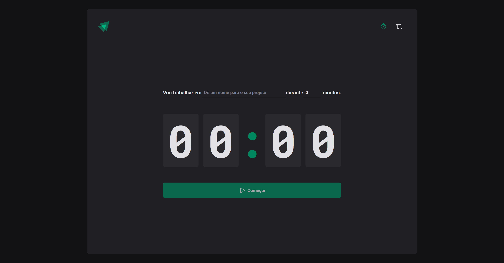

<h1 align="center">Projeto Pomodoro com Histórico</h1>

  <a href="#-tecnologias">Tecnologias</a>&nbsp;&nbsp;&nbsp;|&nbsp;&nbsp;&nbsp;
  <a href="#-projeto">Projeto</a>&nbsp;&nbsp;&nbsp;|&nbsp;&nbsp;&nbsp;
  <a href="#memo-licença">Licença</a>

  

 

  

## 🚀 Tecnologias Utilizadas

Esse projeto foi desenvolvido com as seguintes tecnologias:

- ReactJS: Biblioteca JavaScript para a construção de interfaces de usuário.

- TypeScript: Superset do JavaScript que adiciona tipagem estática ao código.

- Styled Components: Biblioteca para estilizar componentes React com a utilização de tagged template literals.

- Context API e Reducer: Gerenciamento de estado global para facilitar a comunicação entre componentes e manter o estado da aplicação.

- Hook Form: Biblioteca para simplificar a lógica de formulários em React.

- Zod: Biblioteca de validação de esquema para garantir a integridade dos dados.

## 📑 Estrutura do Projeto

- A estrutura do projeto está organizada da seguinte forma:

- src/components: Componentes React reutilizáveis.

- src/context: Configuração do Context API e Reducer para o gerenciamento de estado global.

- src/hooks: Custom hooks utilizados na aplicação.

- src/pages: Páginas da aplicação, cada uma representando uma seção principal, como o temporizador e o histórico.

- src/styles: Estilos globais e temas da aplicação.

## 💻 Projeto

Este é um projeto ReactJS desenvolvido utilizando TypeScript, Styled Components, Context API, Reducer, Hook Form, Zod e outras tecnologias modernas. O objetivo principal do projeto é implementar uma aplicação de Pomodoro, com a funcionalidade de histórico para acompanhar o tempo dedicado a cada tarefa.

## ⚙️ Funcionalidades

Pomodoro Timer: Utiliza a técnica Pomodoro para ajudar na gestão do tempo e aumentar a produtividade. O temporizador é configurável, permitindo ajustar o tempo de trabalho e de pausa.

Histórico de Tarefas: Mantém um registro das tarefas concluídas, mostrando o tempo dedicado a cada uma. O histórico é persistido para que o usuário possa revisitar suas atividades anteriores.

## ❣️ Contribuição

Sinta-se à vontade para contribuir com melhorias, correções de bugs ou novas funcionalidades. Abra uma issue para discutir ideias e sugestões, ou envie um pull request.

Esperamos que este projeto seja útil para o gerenciamento eficiente do tempo, combinando a técnica Pomodoro com um histórico detalhado das tarefas realizadas. Se tiver alguma dúvida ou sugestão, não hesite em entrar em contato. Aproveite o desenvolvimento!

## :memo: Licença

Esse projeto está sob a licença MIT.

---

Feito com ♥ by Gabriel F. :wave:
